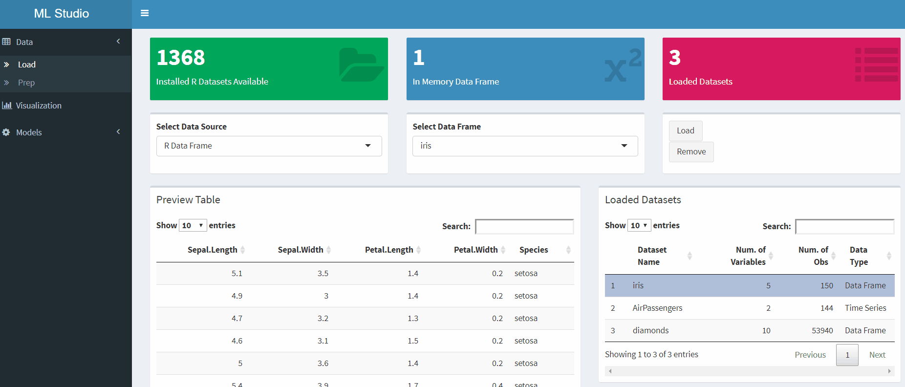
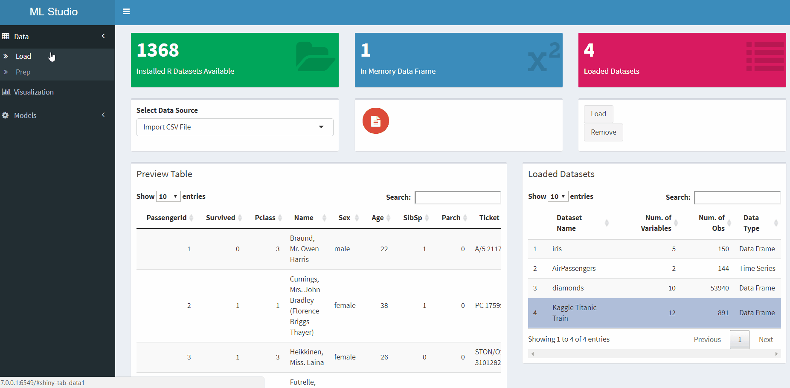
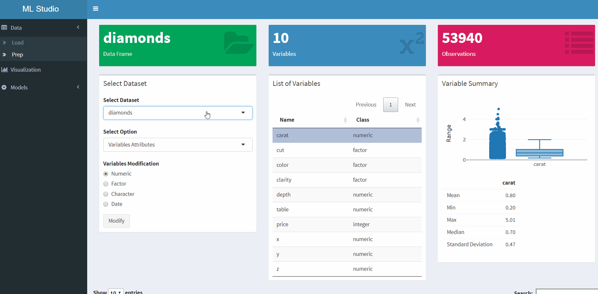
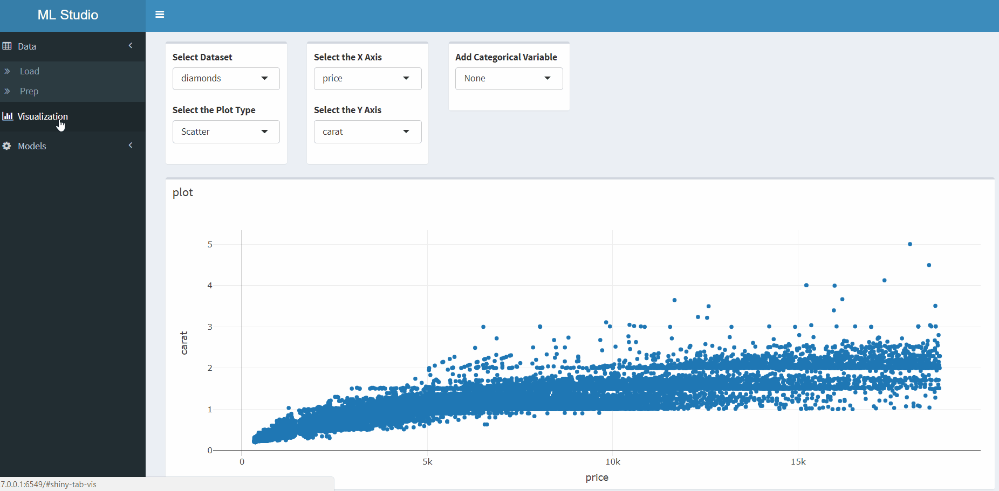
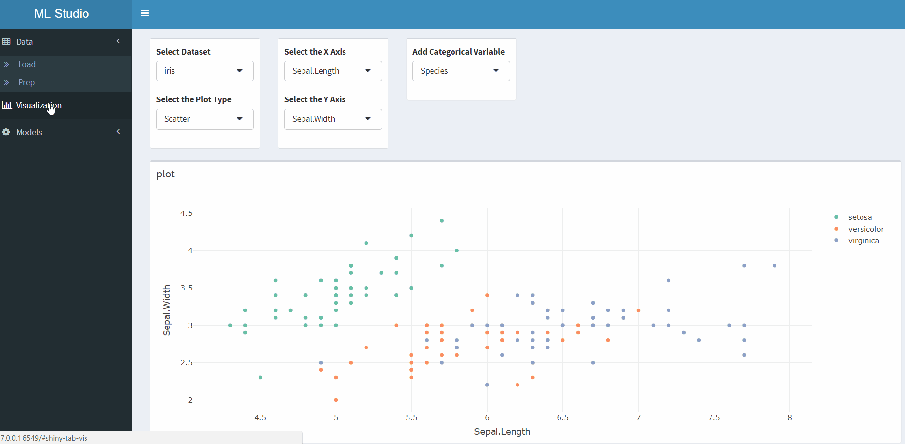
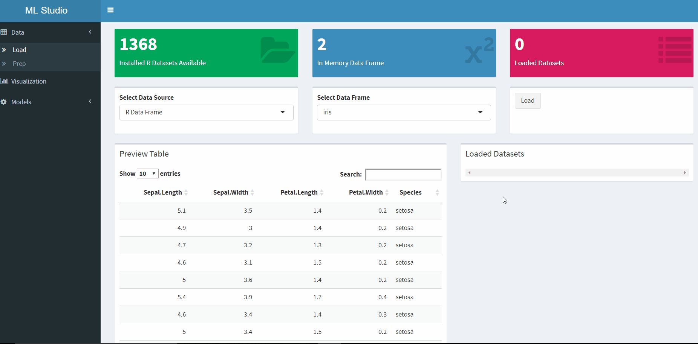

## **Overview**

The ML Studio is an interactive platform for data visualization, statistical modeling and machine learning applications. Based on [Shiny](http://shiny.rstudio.com/) and [shinydashboard](https://rstudio.github.io/shinydashboard/) interface, with [Plotly](https://plot.ly/r/) interactive data visualization, [DT](https://rstudio.github.io/DT/) HTML tables and [H2O](https://www.h2o.ai/) machine learning and deep learning algorithms. The ML Studio provides a set of tools for the data science pipeline workflow.
 
## **Installation**

The package is available for installation with the devtools package (if devetools package is not installed please use `install.packages("devtools")` to install it).

```r
# Install the MLstudio
devtools::install_github("RamiKrispin/MLstudio")
```
Please note – the H2O package may require additional Java adds-in (if not installed) and therefor is listed under the “Suggests” packages list of the MLstudio package (and not under the Imports or Depends list) and won’t be installed automatically during the installation of the MLstudio package. More information about the installation of H2O can be find in [H2O documentation](http://h2o-release.s3.amazonaws.com/h2o/rel-weierstrass/7/index.html) (under the "INSTALL IN R" tab).

## **Getting Start**
### **Launch the App**
The app is launched from R and opened on the default web browser (running best on Google Chrome). To open the app please use:

```r
# Launch the MLstudio
runML()
```

### **Data**

The ML Studio provides the user with the ability to load (or remove), modify, visualize and analyze multiple datasets at the same time.

Under the “Data” tab there are two sub-tabs:

1.	**Load** – set of tools to load data into the platform (from R environment, R datasets and/or csv file)

2.	**Prep** – data prep tools:

- Variables summary
- Ability to modify the variables attributes 
- dplyr data summary


#### **Loading Data**
There are three methods to load a dataset into the platform:

1.	Loading the dataset from the R environment, currently supporting data frame, data table, matrix and ts objects.


2.	Loading the available dataset within installed packages, supporting data frame, data table, matrix and ts objects.


3.	Loading from csv file.



#### **Data Attribution**

The variables attributions can be seen in the “Prep” tab in the middle table, a more in depth summary is available in the variable summary box. Using the variable attributes option, it is possible to modify if needed the attributes. Below is an interactive table, the fields can be sorted and a search option is available. 




### **Data Summary**

A data summary function is available on the “Prep” tab under the “Select Option” dropdown menu. This is a dplyr based function and it provides the ability to summarize data by a specific group. Currently the summary categories are – count, mean, sd, max and min.



### **Visualization**

Utilizing Plotly interactive data visualization tools along with Shiny engine, the ML Studio provides the user with effective tools for data exploration. The "Visualization" tab provides key functionality:

- Application for multivariate visualization – scatter, line, boxplot histogram, density, and correlation plots



- Application for time series visualization - seasonality, boxplot and lags plots



### **Models**

The models applications of the ML Studio are still under development and currently four classification models from the H2O package are available (Deep Learning, GBM, GLM and Random Forest).



Features that are under development:

1. Machine learning applications:
- In depth model summary
- Ability to compare, select and save models
- Regression models
- The caret functions and models
- H2O grid search and autoML
- Deep learning applications with Keras

2. Time series and forecasting:
- Tools for time series analysis
- Forecasting models with the forecast package
